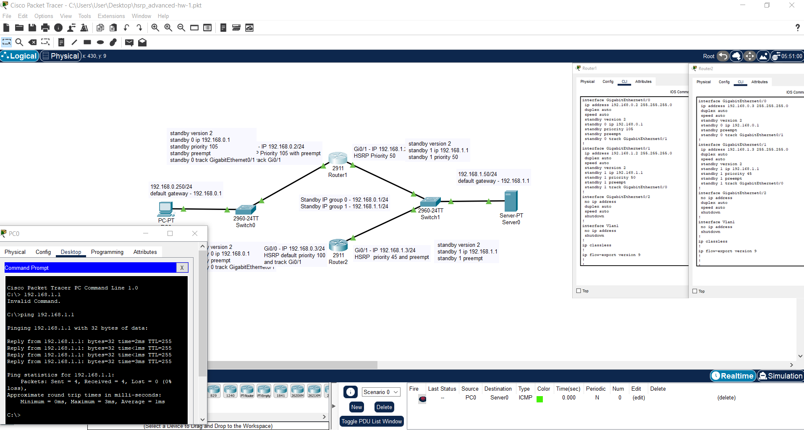
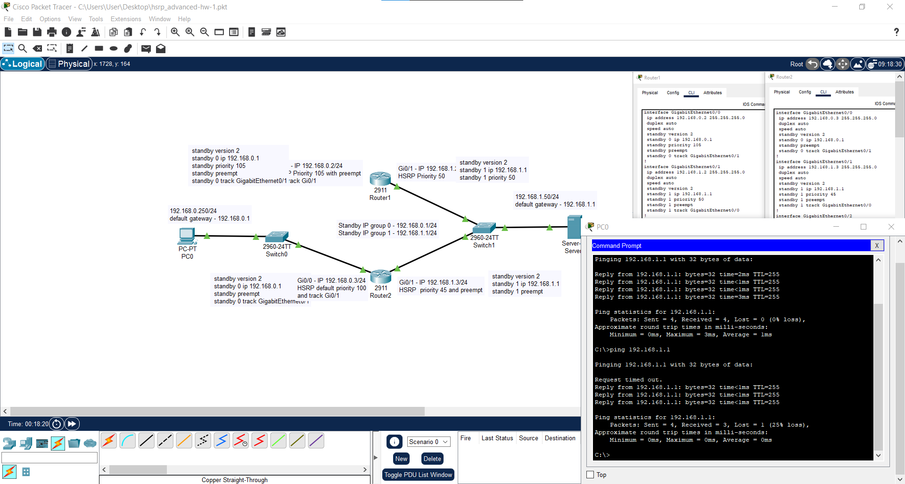

# Домашнее задание Хомякова Антона к занятию 1 «Disaster recovery и Keepalived» 


### Цель задания

В результате выполнения этого задания вы научитесь:
1. Настраивать отслеживание интерфейса для протокола HSRP;
2. Настраивать сервис Keepalived для использования плавающего IP

-----

### Чеклист готовности к домашнему заданию

1. Установлена программа Cisco Packet Tracer
2. Установлена операционная система Ubuntu на виртуальную машину и имеется доступ к терминалу
3. Сделан клон этой виртуальной машины, они находятся в одной подсети и имеют разные IP адреса
4. Просмотрены конфигурационные файлы, рассматриваемые на лекции, которые находятся по ссылке

-----

### Инструкция по выполнению домашнего задания
1. Сделайте fork репозитория c шаблоном решения к себе в Github и переименуйте его по названию или номеру занятия, например, https://github.com/имя-вашего-репозитория/gitlab-hw или https://github.com/имя-вашего-репозитория/8-03-hw).
2. Выполните клонирование этого репозитория к себе на ПК с помощью команды git clone.
3. Выполните домашнее задание и заполните у себя локально этот файл README.md:
  - впишите вверху название занятия и ваши фамилию и имя;
  - в каждом задании добавьте решение в требуемом виде: текст/код/скриншоты/ссылка;
  - для корректного добавления скриншотов воспользуйтесь инструкцией «Как вставить скриншот в шаблон с решением»;
  - при оформлении используйте возможности языка разметки md. Коротко об этом можно посмотреть в инструкции по MarkDown.
4. После завершения работы над домашним заданием сделайте коммит (git commit -m "comment") и отправьте его на Github (git push origin).
5. Для проверки домашнего задания преподавателем в личном кабинете прикрепите и отправьте ссылку на решение в виде md-файла в вашем Github.
6. Любые вопросы задавайте в чате учебной группы и/или в разделе «Вопросы по заданию» в личном кабинете.

-----
### Задание 1
  - Дана схема для Cisco Packet Tracer, рассматриваемая в лекции.
  - На данной схеме уже настроено отслеживание интерфейсов маршрутизаторов Gi0/1 (для нулевой группы)
  - Необходимо аналогично настроить отслеживание состояния интерфейсов Gi0/0 (для первой группы).
  - Для проверки корректности настройки, разорвите один из кабелей между одним из маршрутизаторов и Switch0 и запустите ping между PC0 и Server0.

 ### *Ответ*

## 🖼️ Скриншоты топологии HSRP

  
*Основная схема HSRP с маршрутизаторами*

  
*Дополнительные подключения и failover*

## 📁 Скачать проект Packet Tracer

[Скачать файл hsrp_advanced-hw-1.pkt](./hsrp_advanced-hw-1.pkt)


-----
### Задание 2
  - Запустите две виртуальные машины Linux, установите и настройте сервис Keepalived как в лекции, используя пример конфигурационного файла.
  - Настройте любой веб-сервер (например, nginx или simple python server) на двух виртуальных машинах
  - Напишите Bash-скрипт, который будет проверять доступность порта данного веб-сервера и существование файла index.html в root-директории данного веб-сервера.
  - Настройте Keepalived так, чтобы он запускал данный скрипт каждые 3 секунды и переносил виртуальный IP на другой сервер, если bash-скрипт завершался с кодом, отличным от нуля (то есть порт веб-сервера был недоступен или отсутствовал index.html). Используйте для этого секцию vrrp_script
  - На проверку отправьте получившейся bash-скрипт и конфигурационный файл keepalived, а также скриншот с демонстрацией переезда плавающего ip на другой сервер в случае недоступности порта или файла index.html

 ### *Ответ*


### 🔹 Файл: [check_server.sh](task2/check_server.sh)


```bash
#!/bin/bash
if [[ $(netstat -ant | grep LISTEN | grep :80) ]] && [[ -f /var/www/html/index.nginx-debian.html ]]; then
  exit 0
else
  sudo systemctl stop keepalived
fi
```

🔹 Конфигурационный файл MASTER:[keepalived-11.conf](task2/keepalived-11.conf)


```
vrrp_script check_server {
        script "/home/zabbix/check_server.sh"
        interval 3
}

vrrp_instance VI_1 {
        state MASTER
        interface enp0s8
        virtual_router_id 15
        priority 255
        advert_int 1

        virtual_ipaddress {
                192.168.56.100/24
        }

        track_script {
                check_server
        }
}
```

🔹 Конфигурационный файл BACKUP: [keepalived-22.conf](task2/keepalived-22.conf)


```
vrrp_instance VI_1 {
        state BACKUP
        interface enp0s8
        virtual_router_id 15
        priority 155
        advert_int 1

        virtual_ipaddress {
                192.168.56.100/24
        }
}
```